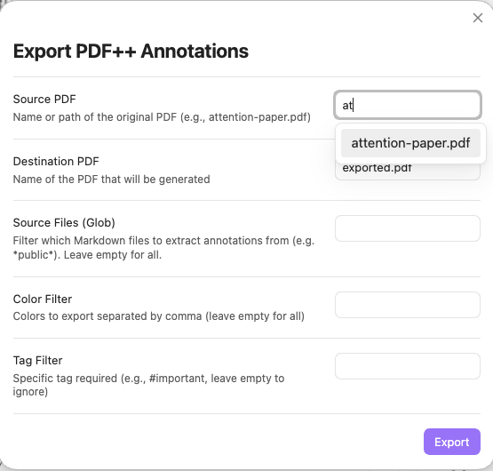
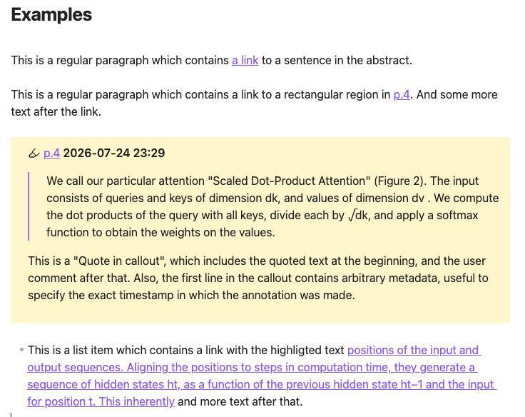
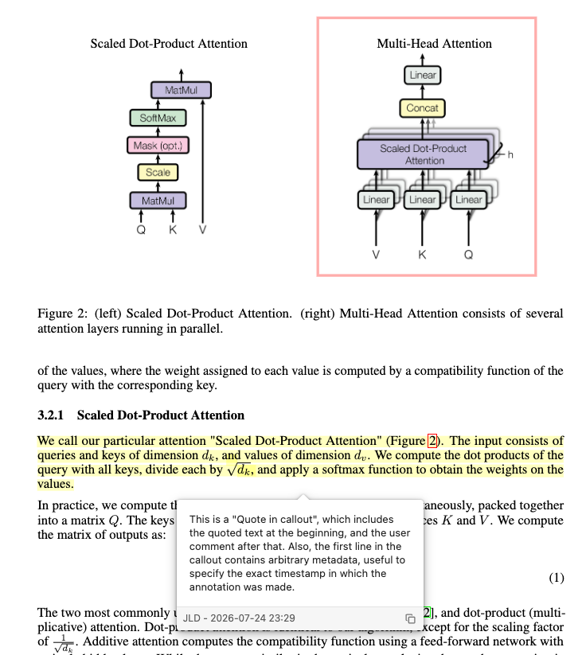
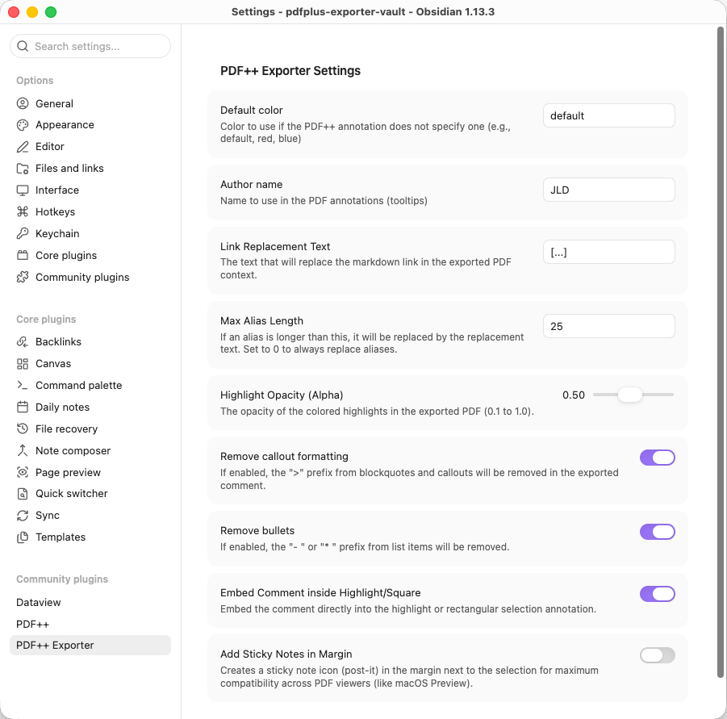

# PDF++ Exporter for Obsidian

**PDF++ Exporter** is an Obsidian plugin designed to "burn" (physically write) your annotations and notes taken in Markdown files back into your PDF documents using standard PDF annotations (highlight rectangles and pop-up comments).

It is the perfect companion for the **PDF++** plugin, allowing you to share your annotated papers, books, or documents with non-Obsidian users (openable in Adobe Acrobat, macOS Preview, PDF.js, or any standard PDF viewer).

---

## 🎯 Purpose

[PDF++](https://github.com/RyotaUshio/obsidian-pdf-plus) enables annotating PDFs without modifying the original files, keeping a pristine copy in your vault and saving all notes, highlights, and comments inside Markdown files.

While this non-destructive approach is ideal inside Obsidian, the connection between your notes and the PDF is lost when you share the document externally. **PDF++ Exporter** solves this by analyzing Markdown backlinks, extracting the context and comments, and generating a standalone, annotated PDF file with native PDF annotations.

---

## 💡 Use Cases

1. **Sharing Annotated Research Papers**:
   Read and highlight papers using PDF++ while writing notes in your vault. Export a final PDF with native color highlights and popup comments to send to colleagues, peer reviewers, or professors.

2. **Document & Contract Review**:
   Annotate contracts or draft documents in Markdown. Export the PDF with your comments as native PDF tooltips/annotations.

---

## ⚙️ Key Features

- **Standalone Operation**: Generates annotations based on PDF++ links without requiring the PDF++ plugin to be enabled during export.
- **Smart Autocomplete**: Modal with quick fuzzy-filtering of PDFs in your vault.
- **Support for All Annotation Types**: Exports both text highlights (`Highlight`) and rectangular area selections (`Square`).
- **Sticky Notes**: Option to generate floating sticky notes (`Text` annotations) with your comments alongside standard highlight popups for maximum compatibility across different PDF viewers (Preview, Edge, Acrobat).
- **Customizable Highlights**:
  - Filter by annotation color or note types.
  - Adjustable opacity (Alpha) to prevent overly saturated highlight colors.
  - Option to embed comments inside the highlighted area, as floating sticky notes, or both.
  - Configurable link replacement text (defaults to `[...]`) to replace Markdown link tags within comment popups.
  - Option to configure a "Max Alias Length". Aliases shorter than this length will be preserved in the comment (useful for manually typed short aliases), while longer auto-generated aliases will be replaced. Set to 0 to always replace.
  - Option to clean up Markdown callouts (`> [!info]`) and list bullets (`- `, `* `).
- **"Dummy PDF" Support**: Complete compatibility with remote/external PDFs referenced via URL.

---

## 🖼️ Screenshots

- **Export Modal**:
  
- **Markdown note containing links to other pdfs**:
  
- **Exported PDF in External Viewer**:
  
- **Settings Panel**:
  

---

## 🛠️ Technical Details & Implementation

### 1. The Comment Extraction Problem (Heuristics & Conventions)

#### The Problem:
Extracting a "comment" from a Markdown file to embed into a PDF popup annotation is an open-ended, ill-defined problem. PDF++ generates the Markdown wikilink pointing to a selection fragment (handling the visual overlay in Obsidian), but it dictates nothing about how users structure their comments around those links. Markdown grants total freedom.

#### The Current Solution (Convention-based Heuristics):
**PDF++ Exporter** resolves this by supporting two common note-taking conventions:

1. **Callout Quotes (`> [!PDF|...]`)**:
   PDF++ can automatically generate callouts containing a quote of the highlighted text followed by user comments. 
   - The plugin extracts the body of the callout as the main comment popup content.
   - Text appended to the callout header (e.g., `> [!PDF|2026-03-06 14:00]`) is parsed as metadata (title/author/timestamp) for the PDF annotation popup header.
2. **Running Text / List Items**:
   Links can be embedded directly within continuous paragraphs or list items (e.g., `"- The finding in [[paper.pdf#page=1|this section]] is prohibitive."`).
   - The exporter extracts the full paragraph or list item, stripping initial list markers (`- `, `* `).
   - Because raw Markdown wikilinks look cluttered inside standard PDF popups, the plugin replaces the link reference with the user-defined replacement text (defaults to `[...]`).
   - If the wikilink contains a short alias manually typed by the user (e.g., `[[paper.pdf#page=1|here]]`), it can be preserved instead of the replacement text by configuring the "Max Alias Length" in settings.

> *Note: As community adoption grows, additional heuristics and user-defined comment extraction patterns will be supported.*

### 2. The Coordinate Mapping Challenge

#### The Problem:
PDF++ does not store physical page coordinates ($X, Y$ bounding boxes) inside Markdown links. Instead, it encodes the text selection inside the URL fragment using line and character offsets relative to PDF.js's extracted text stream (e.g., `#page=1&selection=10,2,12,5`).

#### The Solution:
To draw native `Highlight` rectangles and `QuadPoints` using `pdf-lib`, **PDF++ Exporter** includes a custom geometry engine (`PDFGeometry`) reverse-engineered from PDF++:

1. Loads the page text content using PDF.js (`window.pdfjsLib`).
2. Maps character and line indices from the fragment to glyph containers and text rectangles returned by PDF.js.
3. Converts and merges those rectangles into physical PDF coordinates (with bottom-left origin).
4. Constructs native PDF dictionaries (`PDFDict` / `/Subtype /Highlight` / `/QuadPoints` / `/Rect`) and injects the annotations into the PDF pages using `pdf-lib`.

### 3. Handling "Dummy PDFs" (Remote PDFs)

#### The Problem:
PDF++ supports "Dummy PDFs": local `.pdf` files containing plain text pointing to an external URL (`https://...`). Trying to read or clone these files directly as binary PDF buffers causes corrupted PDF errors.

#### The Solution:
The exporter handles remote PDFs seamlessly through a 3-tier strategy:

1. **Header Detection**: Checks the file header upon reading. If it does not start with `%PDF-` and contains an `http(s)://` URL, remote mode is activated.
2. **Disk Cache Check (PDF++ Fork Integration)**: Checks if the remote PDF was already cached locally by checking for its SHA-256 hash at `.obsidian/plugins/pdf-plus/dummy-cache/HASH.pdf`. If present, it loads directly from disk.
3. **In-Memory Fetching & Caching**: If not cached on disk, fetches the PDF using Obsidian's CORS-bypassing `requestUrl`. The binary is cached in RAM (`pdfBufferCache`) during the export session to prevent duplicate network downloads.
4. **Detached Buffer Protection**: Buffer clones (`buffer.slice(0)`) are passed to rendering engines, preventing memory detachment errors caused by PDF.js Web Workers.

---

## 📜 License

MIT License.
